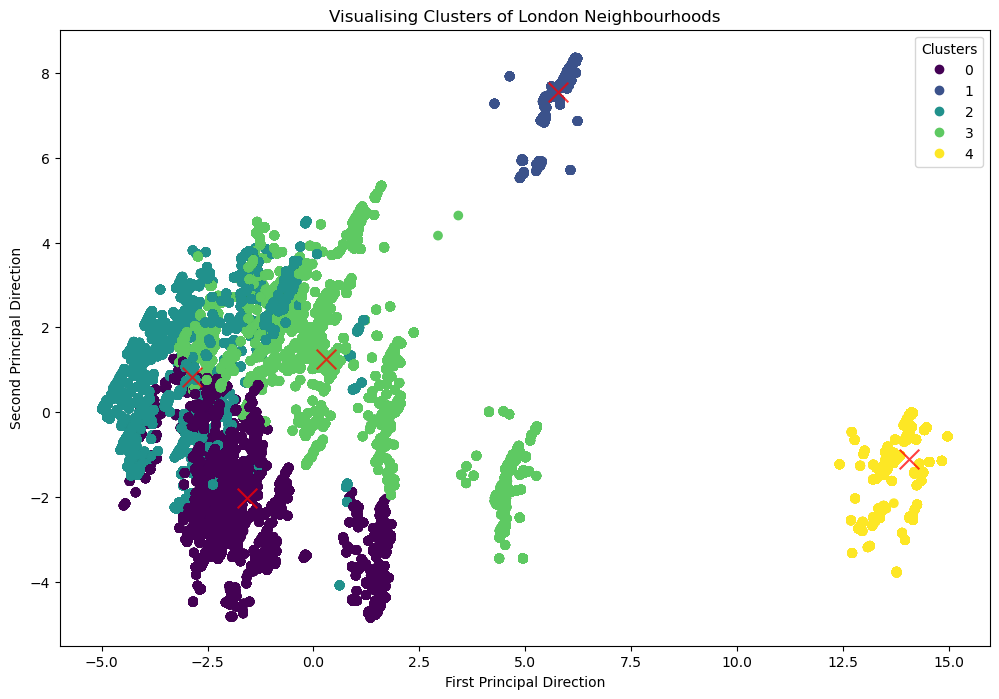
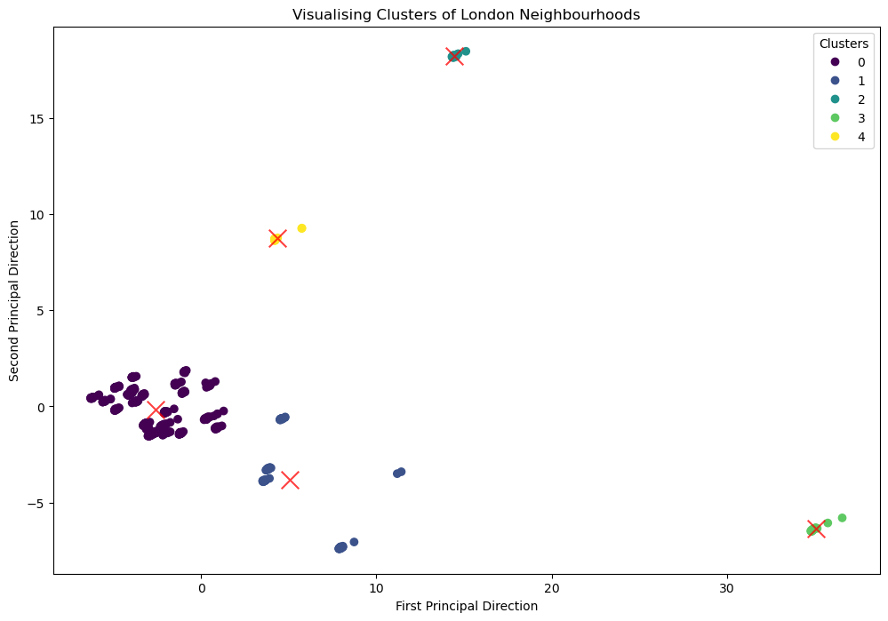
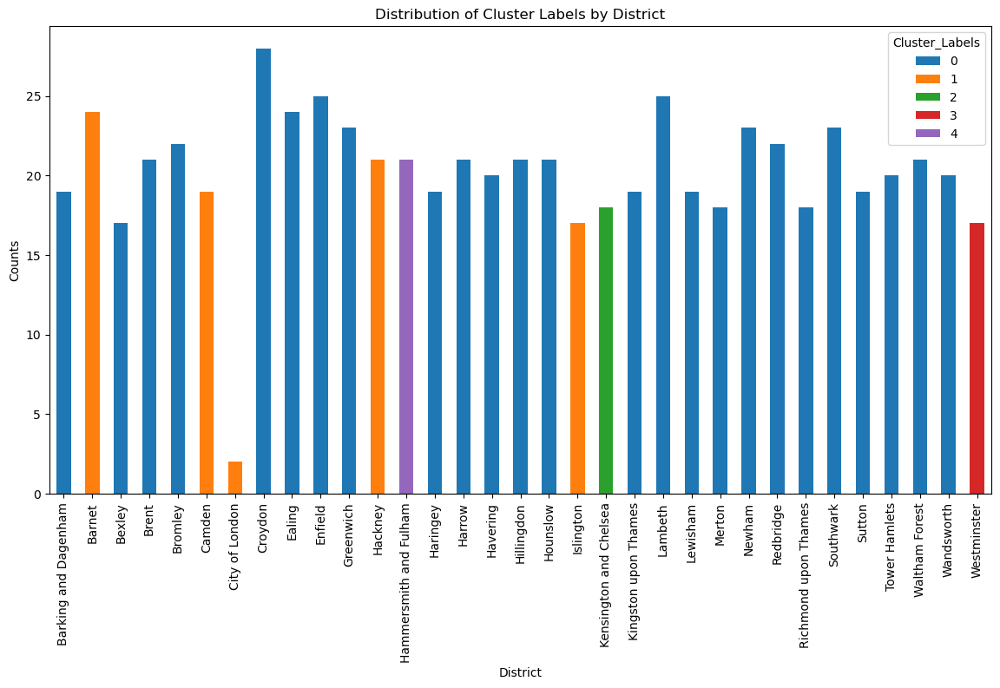

# Project Background

The cost of living crisis in London has reached unprecedented levels, creating significant challenges for residents across all demographics. As of December 2022, housing costs have escalated to twelve times the average annual earnings, with mortgage rates experiencing a substantial 61% increase across the UK. The rental market has seen similar pressures, with the Zoopla Rental Market Report documenting a 13.5% rise in rental costs.

## Current Market Challenges

The housing market faces several critical issues:

- **Severe affordability constraints** affecting both rental and purchase markets.
- **Limited access to comprehensive neighbourhood information**, making informed decisions difficult.
- **Lack of personalised tools** that consider a resident’s financial capacity and lifestyle.
- **Disconnection between resident preferences and available housing options**, causing inefficient relocations.

## Solution Overview

Thrive in the City addresses these challenges through an **AI-powered recommendation system** that provides personalised neighbourhood recommendations. The system employs advanced clustering algorithms to analyse and match user preferences with suitable areas, considering:

- **Housing affordability metrics** (rents and house prices)
- **Local amenities** (hospitals, schools, businesses)
- **Community demographics** (ethnicity, religion, socio-economic factors)
- **Crime rates** (safety indicators per borough/ward)
- **Transport connectivity** (access to public transport)
- **Green spaces** (proximity to parks and open areas)

## Technical Innovation

The platform leverages:

- **Content-based filtering** using **KMeans and DBSCAN** clustering algorithms.
- **Feature scaling with RobustScaler** to ensure fair clustering and reduce outlier effects.
- **Data integration from multiple authoritative sources**, including the **ONS, Gov.uk, Zoopla, and Food Standards Agency**.
- **Interactive web interface built with Streamlit**, providing a user-friendly experience.

## Impact and Reach

The platform serves diverse user groups:

- **Students** looking for affordable housing near universities.
- **Young professionals** balancing affordability with lifestyle.
- **Families** prioritising schools, safety, and green spaces.
- **New London residents** needing insights on different boroughs and districts.

## Current Development Status

The platform is fully operational and accessible at:
🔗 [https://thriveinthecity.streamlit.app/](https://thriveinthecity.streamlit.app/)

## Featured Technologies

- **Backend Processing**: Python with Scikit-learn
- **Data Analysis**: Pandas, NumPy
- **Visualization**: Matplotlib, Seaborn
- **Web Framework**: Streamlit


## Results & Insights

### **1. Data Analysis & Cleaning**
The project processed multiple datasets covering **postcodes, crime rates, rental prices, house prices, businesses, education institutions, and green spaces**. The datasets were aggregated from **authoritative sources** such as the ONS, Gov.uk, Zoopla, and the London DataStore. The key challenge was **ensuring consistency across diverse data formats**, as different datasets contained varying levels of granularity. The following transformations were performed:

- **Missing Data Handling:** Median imputation and filtering for non-relevant entries.
- **Feature Engineering:** Aggregating attributes such as crime rates, housing affordability, and amenities to the borough/district level.
- **Normalization:** Applied **RobustScaler** to handle extreme outliers, ensuring better clustering performance.

## **2. Exploratory Data Analysis (EDA)**

### **Postcode Dataset**
- **Purpose:** Provided geographical segmentation for clustering.
- **Key Insights:** Certain postcodes had significantly higher **median incomes**, aligning with known high-cost areas.

--- 

### **Crime Dataset**
- **Data Source:** London DataStore
- **Processing Steps:**
  - Extracted **borough-level and ward-level crime data**.
  - Aggregated monthly crime counts to **annual summaries**.
  - Normalised data to **crimes per 1,000 residents**.

**Findings:**
- **High-crime areas (e.g., Westminster, Camden) showed correlation with high business density.**
- **Lower-crime zones (e.g., Richmond, Bromley) aligned with family-oriented residential areas.**

---

### **Religion & Ethnicity Dataset**
- **Data Source:** Office for National Statistics (ONS)
- **Processing Steps:**
  - Simplified **58 religion categories** into broader groups.
  - Merged ethnicity statistics with postcode-level demographic data.

**Findings:**
- **Tower Hamlets, Newham, and Redbridge showed the highest religious diversity.**
- **Ethnic diversity was most pronounced in Brent and Ealing.**
- **These factors contribute to different community preferences in housing.**
  
---

### **Rent & Housing Price Dataset**
- **Data Source:** Zoopla & London DataStore
- **Processing Steps:**
  - Consolidated **rental averages by property type**.
  - Normalised price variations between boroughs.
  - Cross-referenced **median rent vs. average income**.

**Findings:**
- **Central boroughs (Westminster, Kensington) had unaffordable rent-to-income ratios (above 60%).**
- **Affordable boroughs (Barking, Dagenham, Havering) had ratios below 35%.**
- **Rent volatility was highest in zones with new development projects.**

---

### **Business & Amenity Dataset**
- **Data Source:** Food Standards Agency, UK Learning Providers Directory
- **Processing Steps:**
  - Categorised businesses into **retail, restaurants, financial services, and healthcare**.
  - Weighted their impact on **neighbourhood livability**.

**Findings:**
- **West End had the highest business density, dominated by restaurants and retail.**
- **Suburban boroughs (e.g., Sutton, Bromley) leaned towards service-based businesses (healthcare, education).**
- **Neighbourhood desirability increased with business diversity.**

---

### **Green Spaces & Hospitals Dataset**
- **Data Source:** Gov.uk & NHS Open Data
- **Processing Steps:**
  - Assigned **nearest parks/hospitals** to each borough.
  - Normalised accessibility scores.

**Findings:**
- **Richmond, Greenwich, and Camden had the highest access to green spaces.**
- **Outer boroughs like Croydon had limited green zones but good hospital accessibility.**
- **This influenced cluster recommendations for health-conscious users.**

---

### **3. Clustering & Model Performance**
This section describes how the dataset was prepared for clustering and how two algorithms, **KMeans** and **DBSCAN**, were evaluated across two modelling phases.  
For the complete details, refer to the **[notebooks](./notebooks/)** directory in this repository (for example, `Clustering_postcode_level.ipynb` and `Clustering_ward_level_Phase_2.ipynb`).

#### Pre-processing & Feature Scaling
To ensure effective clustering:
- **Irrelevant columns** (e.g., unique identifiers, geographic coordinates) that did not contribute to grouping were removed.
- **Numeric data types** were verified for all features; boolean columns (religion & ethnicity) were converted to integer format.
- **StandardScaler** was applied to normalise all numerical values, ensuring each feature contributed equally to distance calculations.

> **Outcome:** A scaled dataset (zero mean, unit variance), primed for accurate cluster formation.

---

#### KMeans (Phase 1)

**Determining Number of Clusters:**
- **Elbow Method** suggested *k=3* or *k=5*.
- **Silhouette Score** peaked at *k=2*.
- **Davies-Bouldin Index** also indicated *k=2*.

Although *k=2* appeared optimal in certain metrics, it was **too coarse** to represent the diversity of London. Consequently, **k=5** was selected to strike a balance between statistical rigour and user-centric recommendations.

**Evaluation & Interpretation:**
- **5 clusters** were formed on the scaled data, resulting in an **average Silhouette Score of approximately 0.1061**, suggesting moderate overlap.
  - One smaller cluster (the “yellow” cluster) displayed distinct characteristics, whilst others exhibited negative silhouette scores, indicating poor separation.

> **Key Observations:**  
> - Cluster overlap hinted at potential outliers or the complexity of high-dimensional data.  
> - Alternative normalisation strategies or changes to feature granularity were considered for further enhancement.

**Visual Example:**  
*Figure A: KMeans (Phase 1) Clusters*  


The silhouette score was approximately 0.1061, showing moderate overlap and negative silhouette values for certain clusters.


#### DBSCAN (Phase 1)

- **Initial parameters** (eps=0.9, min_samples=5) produced **659 clusters plus noise**, leading to over-fragmentation.
- Although DBSCAN can detect natural groupings without specifying *k*, it yielded impractical micro-clusters due to strict parameter settings.

> **Conclusion (Phase 1):** DBSCAN generated minimal actionable insights because of **excessive clustering**.

---

### Phase 2: Refined Clustering Approach

Insights gathered from Phase 1 guided a restructuring of the dataset and updated scaling methods in Phase 2.

#### Changes Made
1. **Shift to District-Level Data**: Reduced the over-segmentation previously encountered with postcode-level information.  
2. **Applied RobustScaler**: Produced more stable clusters by managing outliers more effectively.

#### KMeans (Phase 2)

**Choosing k** (again):
- **Elbow Method**: Identified k=3 as a prominent elbow.
- **Silhouette Score**: Improved around k=5.
- **Davies-Bouldin Index**: Featured noteworthy dips at k=3, k=5, and k=8.

After examining these metrics in tandem with practical requirements, **k=5** was once again selected, now yielding:
- An **improved Silhouette Score of approximately 0.498**.
- Better-defined clusters with less overlap.

> **Observations:**  
> - Mild overlap remained, reflecting inherent similarities amongst certain districts.  
> - Overall, the clustering displayed a more interpretable structure than in Phase 1.

**Final KMeans Clustering**  
*Figure B: KMeans (Phase 2, k=5) on District-Level Data*  


This version reduced overlap significantly, leading to a silhouette score of around 0.498 and more coherent cluster groupings.

#### DBSCAN (Phase 2)

- Adjusted **eps=4** and **min_samples=5** led to **8 clusters plus 18 noise points**.
- Proved more balanced than Phase 1 DBSCAN, but remained relatively granular and less intuitive for swift recommendations.

> **Key Insight:** DBSCAN at district level was more feasible but still less straightforward than KMeans for end-user scenarios.

---

## 4. Comparison & Model Selection

### KMeans vs. DBSCAN Performance

| **Model**                 | **Clusters** | **Noise Points** | **Avg. Silhouette** | **Practicality**         |
|---------------------------|--------------|------------------|---------------------|--------------------------|
| **KMeans (Phase 2, k=5)** | 5            | N/A              | ~0.498             | More user-friendly       |
| **DBSCAN (Phase 2)**      | 8            | 18               | N/A (not direct)    | Potentially over-segmented |

- **KMeans** produced fewer, larger clusters → simpler interpretation within the recommendation interface.
- **DBSCAN** identified finer distinctions but risked excessive segmentation.

### Final Model Choice

**KMeans** was ultimately adopted for the **Thrive in the City** recommendation system for the following reasons:
1. **Enhanced usability**: Fewer clusters allow users to navigate London’s housing landscape more comfortably.  
2. **Sufficient detail**: k=5 offered adequate granularity without overwhelming the interface.  
3. **Consistent outcomes** when integrated with **RobustScaler** at district level.

> **Conclusion**: KMeans provided **actionable, user-friendly insights**, aligning with the goal of directing residents towards their ideal neighbourhoods.

### Additional Visualisation
*Figure B: KMeans Cluster Labels*  


This final image displays the **labelled clusters** produced by the model, offering a clear view of how different neighbourhoods group together under the selected preferences.

**Further Details**  
- For code and deeper analysis, see the **[notebooks folder](./notebooks/)** (for instance, `Clustering_postcode_level.ipynb` and `Clustering_ward_level_Phase_2.ipynb`).  
- Additional data cleaning scripts can be found under **[`src/data/`](./src/data/)**.

---

## **User Interface & Recommendations**

The **Thrive in the City** web interface offers:

- **Dynamic filtering sliders** for preference inputs (e.g., crime rate tolerance, rent affordability).
- **Real-time clustering updates**, recalculating recommendations as weights change.
- **Interactive visualisations**, highlighting borough- or district-level insights (schools, green spaces, crime stats, etc.).

*Figure A: Example of the Streamlit interface displaying user filters and recommended neighbourhoods*  


> A live demo is accessible at: [Thrive in the City Streamlit App](https://thriveinthecity.streamlit.app/)  
> (Or, link to a local version or video walkthrough if the app is not publicly hosted.)

**How It Works**  
1. **Set Your Criteria**: Move the sliders for crime tolerance, budget, or lifestyle priorities.  
2. **View Recommended Clusters**: The interface updates the cluster assignments in real time.  
3. **Explore Neighbourhood Insights**: Click on boroughs/districts for deeper data on schools, hospitals, and more.

For further details on the UI logic and code, refer to the **[`app.py`](./app.py)** file in the repository.
## **Challenges & Future Improvements**

- **Limitations in postcode-level granularity:** Future versions will integrate **more detailed spatial datasets**.
- **Feature expansion:** Additional socio-economic indicators could improve clustering accuracy.
- **Hybrid recommendation model:** A combination of **content-based and collaborative filtering** for deeper personalization.


## Future Development Opportunities

Based on the project's findings and user feedback, several potential enhancements have been identified that could further improve the platform's effectiveness:

The system architecture could be expanded to include:
- Integration capabilities for real-time property market data feeds to provide current market valuations
- Enhanced granularity in neighbourhood mapping to offer street-level recommendations
- Machine learning model refinements to incorporate user interaction patterns
- Additional data sources for more comprehensive neighbourhood profiling

These opportunities for enhancement emerged from the project's evaluation phase and represent valuable directions for future research or implementation. While these features weren't implemented within the scope of the dissertation project, they highlight the platform's potential for growth and improvement in addressing London's housing accessibility challenges.

The identification of these potential improvements demonstrates the project's thorough consideration of long-term sustainability and scalability in addressing urban housing challenges.

---

# Installation Instructions

## Prerequisites
- **Python:** This project requires Python 3.6 or higher. Download Python from [https://www.python.org/downloads/](https://www.python.org/downloads/).
- **pip:** Ensure that pip is installed along with Python.

## Step 1: Set Up a Virtual Environment
Create and activate a virtual environment to manage the dependencies for the project.
```bash
python3 -m venv venv
source venv/bin/activate  # On Windows use `venv\Scripts\activate`
```

## Step 2: Install Required Packages
Install all dependencies listed in the requirements.txt file using pip and environment.yml for conda environments.
```bash
pip install -r requirements.txt
```

## Step 3: Run the Application
Finally, run the application using Streamlit. The application's entry point is `app.py`:
```bash
streamlit run app.py
```
To use the deployed web application:
https://thriveinthecity.streamlit.app/

# Python Imports in the Project
The following Python libraries are used throughout the project:
- streamlit
- os
- pandas
- numpy
- joblib
- pydeck
- matplotlib.pyplot
- matplotlib.cm
- sklearn (various modules)
- geopy.geocoders
- geopy.extra.rate_limiter
- pyproj
- geopandas
- shapely.geometry
- scipy

# Project Structure

The project is organized into several directories and files:

- `app.py`: The main Streamlit application script that can be launched with the command.
- `data/`: This directory contains all the data used in the project.
  - `evaluation_images/`: Contains images used for evaluating models or results.
  - `processed/`: Includes processed data files that have been cleaned and transformed for analysis.
  - `raw/`: Raw data files as obtained from the original sources.
- `models/`: Contains the machine learning models saved as `.pkl` files, and scaler objects.
  - `old_models/`: Archive of previous versions of models.
- `notebooks/`: Jupyter notebooks where the data merging and model training processes are documented.
  - `Clustering_postcode_level.ipynb`: Notebook detailing clustering at the postcode level.
  - `Clustering_ward_level.ipynb`: Notebook for ward-level clustering.
  - `Clustering_ward_level_Phase_2.ipynb`: Continuation of ward-level clustering, phase 2.
- `src/`: Contains the proprietary source code for the project.
  - `data/`: Scripts for data cleaning and preprocessing tasks, such as:
    - `DataCleaningBusinesses.py`
    - `DataCleaningCrimeLevel.py`
    - ... (and other data cleaning scripts)
  - `UI/`: The user interface code for the web application.
- `venv/`: The directory for the virtual environment containing Python binaries and the installed packages.
- `requirements.txt`: Lists the Python dependencies for pip to install.

Run the application using the following command:
```bash
streamlit run UI/app.py
```

Make sure to navigate to the `UI` directory before running the command if your terminal is not already in that directory.

## Interactive Development with Jupyter in VSCode

For an enhanced interactive development experience, especially useful for running data cleaning and processing scripts, I recommend using the Jupyter extension for Visual Studio Code.

### Installation and Setup

1. If not already installed, download and install [Visual Studio Code](https://code.visualstudio.com/).
2. Inside VSCode, install the Jupyter extension by searching for it in the Extensions view (`Ctrl+Shift+X` or `Cmd+Shift+X` on macOS).
3. To enable sending code selections to the interactive Jupyter window:
   - Go to `File > Preferences > Settings` (or `Code > Preferences > Settings` on macOS).
   - Search for `Jupyter: Send Selection To Interactive Window`.
   - Ensure the checkbox for this setting is ticked.

### Running Data Cleaning Scripts

With the Jupyter extension installed and configured, you can easily run individual code cells of a `.py` file similar to how you would in a Jupyter Notebook.

- Open any of the data cleaning `.py` files located in the `src/data/` directory.
- Highlight the line of code and pressing `Shift+Enter`.

This setup streamlines the process of testing and running your data cleaning scripts, making it easier to iterate on your code.

Note: Ensure that your Python environment is activated and that all dependencies are installed for the scripts to run successfully.
